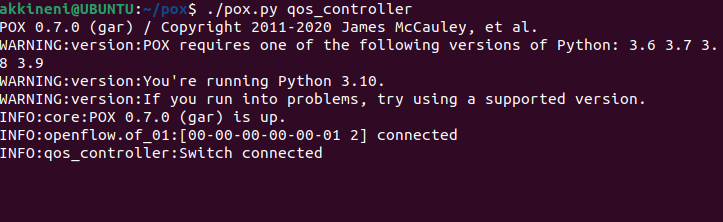
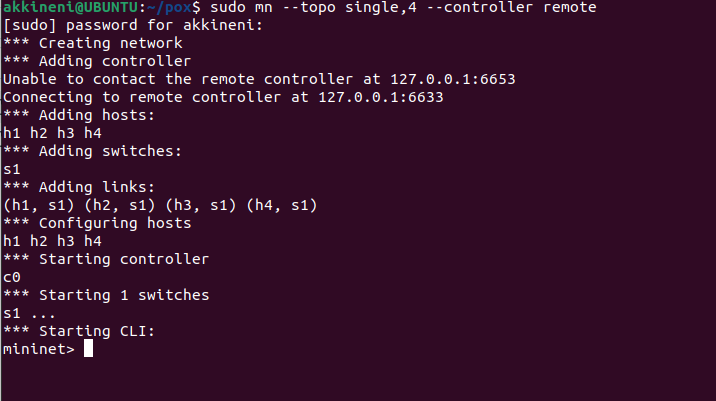
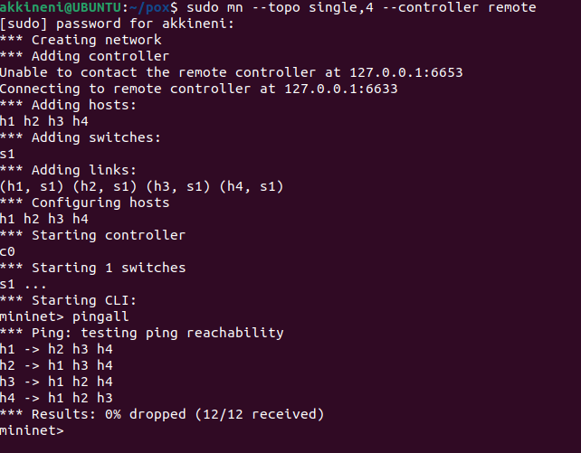
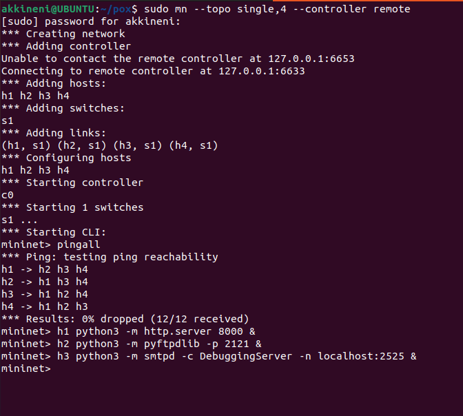
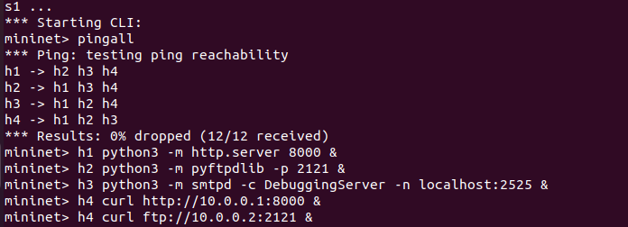
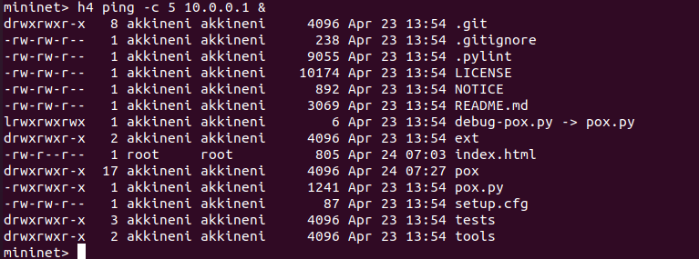
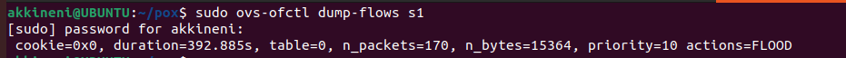
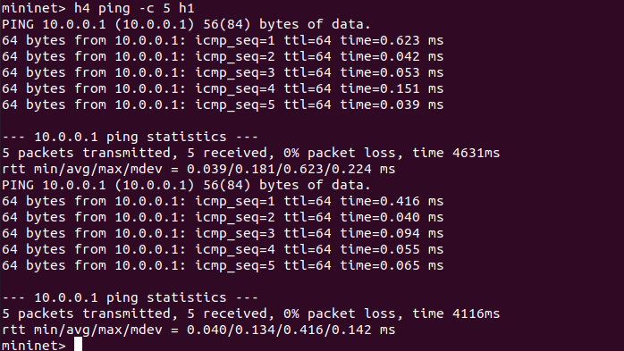
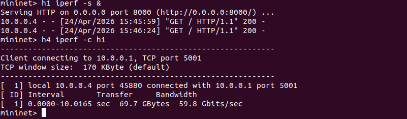

# 📌 Advanced QoS Priority Controller using SDN (POX + Mininet)

---

## 📖 Problem Statement

Design and implement a **Software Defined Networking (SDN) based QoS controller** that prioritizes multiple types of network traffic using OpenFlow rules.

The controller dynamically classifies traffic (HTTP, FTP, SMTP, ICMP) and assigns priority levels to optimize performance.

---

## 🎯 Objectives

* Identify multiple traffic types (HTTP, FTP, SMTP, ICMP)
* Assign priority levels using SDN controller
* Install OpenFlow flow rules dynamically (match–action)
* Implement **idle timeout (soft timeout)** and **hard timeout**
* Measure and analyze performance (latency & throughput)

---

## 🧠 Concept Overview

Traditional networks treat all packets equally. Using SDN:

* Traffic is centrally controlled
* Flow rules are dynamically installed
* Critical traffic gets higher priority

### 📊 Priority Mapping

| Protocol | Port | Priority     |
| -------- | ---- | ------------ |
| ICMP     | -    | 50 (Highest) |
| HTTP     | 8000 | 40           |
| SMTP     | 2525 | 30           |
| FTP      | 2121 | 20           |
| Others   | -    | 10 (Lowest)  |

---

## 🏗️ Network Topology

```
h1 ----\
        \
h2 ----- s1 ----- h4 (Client)
        /
h3 ----/
```

* h1 → HTTP Server
* h2 → FTP Server
* h3 → SMTP Server
* h4 → Client (generates traffic)
* s1 → OpenFlow Switch
* POX → SDN Controller

---

## ⚙️ Technologies Used

* Mininet
* POX Controller
* OpenFlow Protocol
* Python
* Open vSwitch

---

## 🛠️ Installation Steps

```bash
sudo apt update
sudo apt upgrade -y
sudo apt install mininet openvswitch-switch git python3 python3-pip -y
cd ~
git clone https://github.com/noxrepo/pox.git
```

---

## ▶️ Execution Steps

### 🔹 Step 1: Start Controller

```bash
cd ~/pox
./pox.py qos_controller
```

---

### 🔹 Step 2: Start Mininet

(Open new terminal)

```bash
sudo mn --topo single,4 --controller remote
```

---

## 🖥️ Start Servers (Inside Mininet)

### 🌐 HTTP Server (h1)

```bash
h1 python3 -m http.server 8000 &
```

### 📁 FTP Server (h2)

```bash
sudo apt install python3-pyftpdlib -y
h2 python3 -m pyftpdlib -p 2121 &
```

### 📧 SMTP Server (h3)

```bash
h3 python3 -m smtpd -c DebuggingServer -n localhost:2525 &
```

---

## 🧪 Traffic Generation (Client: h4)

### 🔥 Simultaneous Traffic

```bash
h4 curl http://10.0.0.1:8000 &
h4 curl ftp://10.0.0.2:2121 &
h4 ping -c 5 10.0.0.1 &
```

---

## 📊 Performance Measurement

### Latency (ICMP)

```bash
h4 ping -c 5 h1
```

### Throughput (TCP)

```bash
h4 iperf -c h1
```

---

## 🔍 Flow Table Verification

### Show Flow Table

```bash
sudo ovs-ofctl dump-flows s1
```

---

## 🧩 SDN Logic

* Controller listens for **PacketIn events**
* Identifies protocol using TCP port numbers
* Installs flow rules using **match-action**
* Assigns:

  * Priority
  * Idle timeout
  * Hard timeout

---

## ⏱️ Timeout Explanation

* **Idle Timeout (Soft Timeout)**
  Removes flow if inactive for a specific time

* **Hard Timeout**
  Removes flow after fixed duration regardless of activity

---

## 🧪 Test Scenarios

### ✅ Scenario 1: High Priority Traffic

* ICMP → Lowest latency

### ✅ Scenario 2: Medium Priority Traffic

* HTTP → Faster than FTP

### ✅ Scenario 3: Low Priority Traffic

* FTP → Lower priority handling

---

## 📸 Proof of Execution











---

## 📈 Performance Analysis

* High-priority traffic (ICMP) shows **lower latency**
* Medium-priority traffic (HTTP) performs better than FTP
* Flow rules dynamically adapt based on traffic type

---

## ✅ Functional Features

* Multi-protocol traffic classification
* Dynamic flow rule installation
* Priority-based QoS
* Timeout-based flow management
* Simultaneous traffic handling

---

## 🎤 Viva Explanation

> “This project implements QoS using SDN by classifying traffic based on protocol ports. Each traffic type is assigned a priority, and flow rules are installed dynamically with timeouts. Performance is analyzed using latency and throughput measurements.”

---

## 📚 References

* POX Controller Documentation
* Mininet Documentation
* OpenFlow Specification

---


## 🎯 Conclusion

This project demonstrates how SDN enables flexible QoS control by dynamically prioritizing traffic. Using OpenFlow rules with timeouts, the network adapts efficiently to different traffic types and improves overall performance.

---
